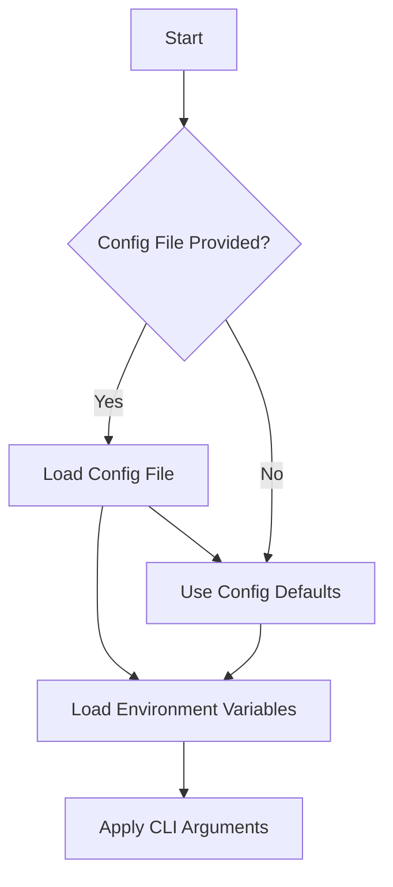
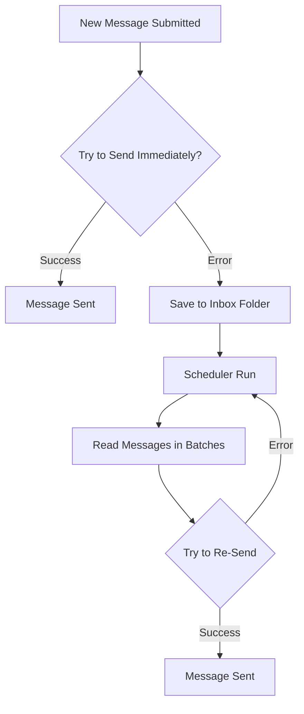

# Developer Guide


[English](developer-guide.md) | [Qyrgyz](docs/qy/developer-guide.md)

Welcome to the KPow project! This document provides pointers for navigating and contributing to the codebase.

## Project Layout

- **cmd/** – Command line interface built with Cobra. The `start` command lives here.
- **config/** – Configuration structs and helpers. `GetConfig` merges config files, environment variables and CLI flags.
- **server/** – Core application code. Contains HTTP server setup, form handling, encryption helpers, mailers and cron jobs.
- **styles/** – Tailwind CSS sources. `just styles` compiles them into the assets under `server/public/`.
- **art/** – Images used in documentation or the web interface.

## Getting Started

1. **Install Go** – The project uses Go modules. Ensure you have Go 1.21+ installed.
2. **Install Bun (optional)** – Needed to rebuild styles with `just styles`.
3. **Run the server**
   ```sh
   go run main.go start
   ```
   CLI flags override environment variables and configuration files (see `readme.md`).

## Configuration

Settings can be supplied via a TOML file, environment variables, or CLI flags. See `config/config.go` for all available options. The example `config.toml` and `example.env` provide useful defaults.

Key configuration topics:

- **Server** – Port, host, logging and request limits.
- **Mailers** – SMTP or webhook destinations. Failed messages are stored in an inbox folder.
- **Encryption** – Supports `age`, `pgp`, or `rsa` public keys. Keys are loaded on start and used to encrypt form submissions.
- **Scheduler** – A cron job retries sending failed messages from the inbox.

To specify the encryption key via a config file, include a `[key]` section:

```toml
[key]
kind = "age"           # or "pgp" or "rsa"
path = "/etc/kpow/key.pub"
advertise = false
```

### Configuration flow



### Verify your configuration

```sh
./kpow verify --config=config.toml
```

## Development Tips

- **Templates** live in `server/templates/` and define the HTML form and error pages. Update these to customize the UI.
- **Middleware** is configured in `server/server.go` – CSRF protection, rate limiting and body limits can be adjusted there.
- **Cron jobs** are located under `server/cron/`. The inbox cleaner periodically attempts to resend failed messages.
- **Encryption utilities** reside in `server/enc/`. Use the tests here as references for encrypting data.

### Generating Keys

Use the following commands to create test keys for development:

#### Age

```sh
age-keygen -o age.key
grep "^# public key:" age.key | cut -d' ' -f3 > age.pub
```

#### PGP

```sh
gpg --quick-generate-key "Your Name <you@example.com>"
gpg --armor --export you@example.com > pgp.pub
```

#### RSA

```sh
openssl genpkey -algorithm RSA -out rsa_private.pem -pkeyopt rsa_keygen_bits:2048
openssl rsa -pubout -in rsa_private.pem -out rsa_public.pem
```

The `rsa_public.pem` file must contain a PKIX PEM‑encoded key.

### Mailer retry flow




## Running Tests

```sh
go test ./...
```

(Tests may require network access to download toolchains.)

## Contributing

1. Fork the repository and create a feature branch.
2. Follow standard Go formatting (`gofmt`).
3. Add tests for new functionality when possible.
4. When adding a new feature or fixing a bug, tests are required.
5. Submit a pull request describing your changes.

For a deeper explanation of how the form, encryption and retry logic work, see `readme.md` and the source comments throughout the `server` package.


## Releasing

Before tagging a new release, work through this open source checklist:

1. Run `just test` to verify all tests pass.
2. Build the binaries with `just build` or use GoReleaser for official releases.
3. Verify that all dependencies use acceptable licenses.
4. Review commits for secrets or credentials and remove anything sensitive.
5. Create and push a new git tag for the release.

The project is currently under the Business Source License 1.1 and will
switch to the Apache License 2.0 on 2028‑12‑04 as noted in the README.
