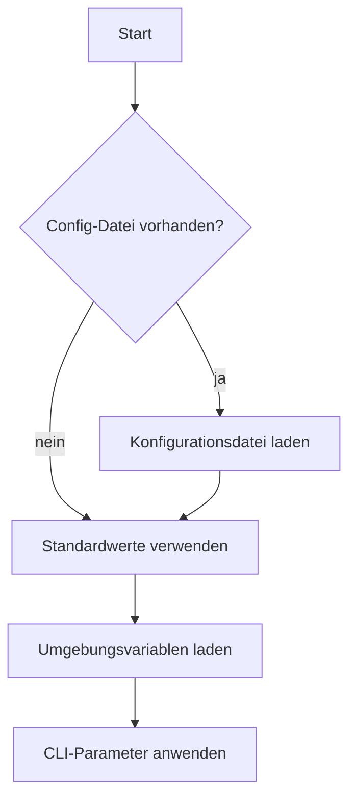
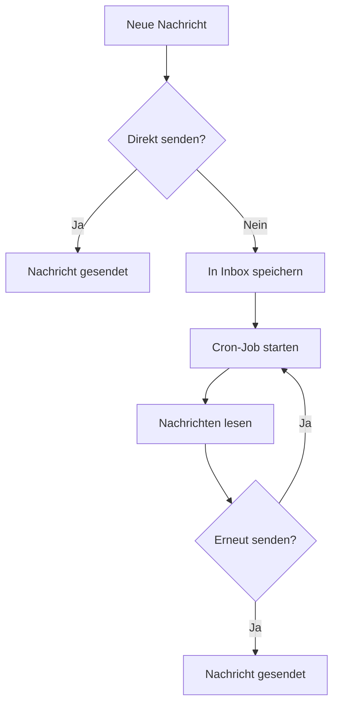

# Entwicklerhandbuch

[Deutsch](developer-guide.md) | [English](../../developer-guide.md) | [Qyrgyz](../qy/developer-guide.md)

Dieses Dokument hilft dir, dich im KPow-Projekt zurechtzufinden und Beiträge beizusteuern.

-   **cmd/** – Befehlszeilenschnittstelle auf Basis von Cobra. Hier befindet sich der Befehl `start`.
-   **config/** – Konfigurationsstrukturen und Hilfsfunktionen. `GetConfig` führt Konfigurationsdateien, Umgebungsvariablen und CLI-Flags zusammen.
-   **server/** – Kern der Anwendung. Enthält HTTP-Server, Formularverarbeitung, Verschlüsselung, Mailer und Cron-Dienste.
-   **styles/** – Tailwind-CSS-Stile. `just styles` kompiliert sie.
-   **art/** – Grafiken, die in der Dokumentation oder im Web-Interface verwendet werden.

1. **Go installieren** – Das Projekt nutzt Go-Module. Installiere Go 1.21 oder höher.
2. **Bun** – Wird für `just styles` benötigt.
3. **Server starten**

```sh
./kpow start --config=config.yml
```

CLI-Flags überschreiben Umgebungsvariablen und Einträge in der Konfigurationsdatei.

## Konfiguration

Einstellungen können per TOML-Datei, Umgebungsvariablen oder CLI-Flags gesetzt werden. Eine Übersicht liefert `config/config.go`. Beispiele findest du in `config.toml` und `example.env`.

-   **Server** – Port, Host, Logging und Request-Limits.
-   **Mailer** – Versand per SMTP oder Webhook. Fehlgeschlagene Nachrichten landen im Inbox-Ordner.
-   **Verschlüsselung** – Unterstützt öffentliche Schlüssel vom Typ `age`, `pgp` oder `rsa`.
-   **Scheduler** – Cron-Job, der den Inbox-Ordner erneut versucht zu versenden.

Beispiel zur Angabe des Schlüssels in der Konfigurationsdatei:

```toml
[key]
kind = "age"           # oder "pgp" bzw. "rsa"
path = "/etc/kpow/key.pub"
advertise = false
```

### Ablauf der Konfiguration



### Konfiguration prüfen

```sh
./kpow verify --config=config.toml
```

## Tipps für die Entwicklung

-   **Templates** befinden sich unter `server/templates/` für Formulare und Fehlerseiten.
-   **Middleware** in `server/server.go` – CSRF-Schutz, Rate-Limiting und Body-Limits.
-   **Cron-Jobs** liegen in `server/cron/`. Versucht erneut zu senden, was im Inbox-Ordner liegt.
-   **Verschlüsselungs-Helfer** findest du unter `server/enc/`.

### Schlüssel generieren

Age:

```sh
age-keygen -o age.key
grep "^# public key:" age.key | cut -d' ' -f3 > age.pub
```

PGP:

```sh
gpg --quick-generate-key "Dein Name <du@example.com>"
gpg --armor --export du@example.com > pgp.pub
```

RSA:

```sh
openssl genpkey -algorithm RSA -out rsa_private.pem -pkeyopt rsa_keygen_bits:2048
openssl rsa -pubout -in rsa_private.pem -out rsa_public.pem
```

`rsa_public.pem` muss im PKIX-PEM-Format vorliegen.

### Mailer-Ablauf



## Tests ausführen

```sh
go test ./...
```

(Tests benötigen ggf. Internetzugang.)

## Mitwirken

1. Repository forken und Feature-Branch anlegen.
2. Mit `gofmt` formatieren.
3. Für neue Funktionalität Tests hinzufügen.
4. Pull-Request eröffnen.

Weitere Details zu Formular, Verschlüsselung und Retry-Logik findest du in `readme.md` sowie in den Kommentaren im Paket `server`.

## Releases

1. `just test` ausführen.
2. Mit `just build` oder GoReleaser bauen.
3. Lizenzen prüfen.
4. Sicherstellen, dass keine sensiblen Daten im Commit landen.
5. Git-Tag setzen.

Das Projekt steht unter der Business Source License 1.1 und wechselt laut README am 04.12.2028 auf die Apache License 2.0.
