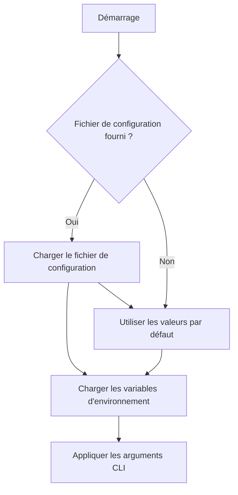
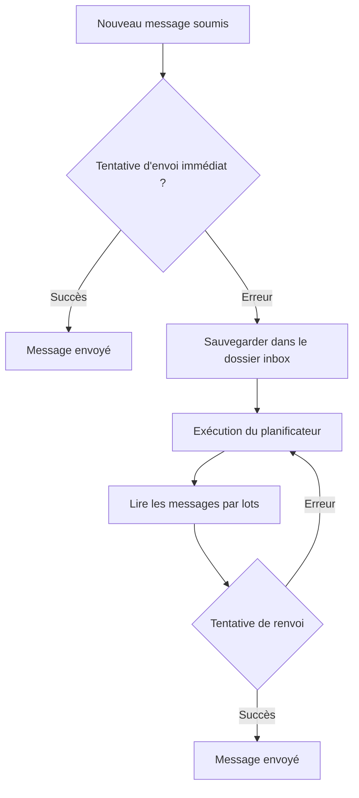

# Guide du développeur

[English](../../developer-guide.md) | [Deutsch](../de/developer-guide.md) | [Türkçe](../tr/developer-guide.md) | [Qyrgyz](../qy/developer-guide.md) | [Français](developer-guide.md) | [Українська](../uk/developer-guide.md) | [Русский](../ru/developer-guide.md)

Bienvenue dans le projet KPow ! Ce document vous aide à naviguer dans le code source et à y contribuer.

## Structure du projet

- **cmd/** – Interface en ligne de commande construite avec Cobra. La commande `start` se trouve ici.
- **config/** – Structures de configuration et fonctions utilitaires. `GetConfig` fusionne les fichiers de configuration, les variables d'environnement et les flags CLI.
- **server/** – Code applicatif principal. Contient la configuration du serveur HTTP, le traitement des formulaires, les utilitaires de chiffrement, les mailers et les tâches cron.
- **styles/** – Sources Tailwind CSS. `just styles` les compile dans les assets sous `server/public/`.
- **art/** – Images utilisées dans la documentation ou l'interface web.

## Premiers pas

1. **Installer Go** – Le projet utilise les modules Go. Assurez-vous d'avoir Go 1.21+ installé.
2. **Installer Bun (optionnel)** – Nécessaire pour recompiler les styles avec `just styles`.
3. **Lancer le serveur**
    ```sh
    go run main.go start
    ```
    Les flags CLI ont priorité sur les variables d'environnement et les fichiers de configuration (voir `readme.md`).

## Configuration

Les paramètres peuvent être fournis via un fichier TOML, des variables d'environnement ou des flags CLI. Consultez `config/config.go` pour toutes les options disponibles. Les fichiers `config.toml` et `example.env` fournissent des valeurs par défaut utiles.

Principaux sujets de configuration :

- **Serveur** – Port, hôte, journalisation et limites de requêtes.
- **Mailers** – Destinations SMTP ou webhook. Les messages échoués sont stockés dans un dossier inbox.
- **Chiffrement** – Supporte les clés publiques `age`, `pgp` ou `rsa`. Les clés sont chargées au démarrage et utilisées pour chiffrer les soumissions de formulaire.
- **Planificateur** – Une tâche cron réessaie l'envoi des messages échoués depuis l'inbox.

Pour spécifier la clé de chiffrement via un fichier de configuration, incluez une section `[key]` :

```toml
[key]
kind = "age"           # ou "pgp" ou "rsa"
path = "/etc/kpow/key.pub"
advertise = false
```

### Flux de configuration



### Vérifier votre configuration

```sh
./kpow verify --config=config.toml
```

## Conseils de développement

- **Templates** se trouvent dans `server/templates/` et définissent le formulaire HTML et les pages d'erreur. Modifiez-les pour personnaliser l'interface.
- **Middleware** est configuré dans `server/server.go` – la protection CSRF, la limitation de débit et les limites de corps de requête peuvent y être ajustées.
- **Tâches cron** se trouvent sous `server/cron/`. Le nettoyeur d'inbox tente périodiquement de renvoyer les messages échoués.
- **Utilitaires de chiffrement** résident dans `server/enc/`. Utilisez les tests comme références pour le chiffrement des données.

### Génération de clés

Utilisez les commandes suivantes pour créer des clés de test pour le développement :

#### Age

```sh
age-keygen -o age.key
grep "^# public key:" age.key | cut -d' ' -f3 > age.pub
```

#### PGP

```sh
gpg --quick-generate-key "Your Name <you@example.com>"
gpg --armor --export you@example.com > pgp.pub
```

#### RSA

```sh
openssl genpkey -algorithm RSA -out rsa_private.pem -pkeyopt rsa_keygen_bits:2048
openssl rsa -pubout -in rsa_private.pem -out rsa_public.pem
```

Le fichier `rsa_public.pem` doit contenir une clé encodée en PEM au format PKIX.

### Flux de réessai du mailer



## Exécution des tests

```sh
go test ./...
```

(Les tests peuvent nécessiter un accès réseau pour télécharger des toolchains.)

## Contribuer

1. Forkez le dépôt et créez une branche de fonctionnalité.
2. Respectez le formatage Go standard (`gofmt`).
3. Ajoutez des tests pour les nouvelles fonctionnalités lorsque c'est possible.
4. Lors de l'ajout d'une nouvelle fonctionnalité ou de la correction d'un bug, les tests sont requis.
5. Soumettez une pull request décrivant vos modifications.

Pour une explication plus détaillée du fonctionnement du formulaire, du chiffrement et de la logique de réessai, consultez `readme.md` et les commentaires dans le package `server`.

## Publication

Avant de taguer une nouvelle version, suivez cette checklist open source :

1. Lancez `just test` pour vérifier que tous les tests passent.
2. Compilez les binaires avec `just build` ou utilisez GoReleaser pour les versions officielles.
3. Vérifiez que toutes les dépendances utilisent des licences acceptables.
4. Examinez les commits pour détecter des secrets ou des identifiants et supprimez tout contenu sensible.
5. Créez et poussez un nouveau tag git pour la version.

Le projet est actuellement sous la Business Source License 1.1 et passera sous la Apache License 2.0 le 04/12/2028, comme indiqué dans le README.
