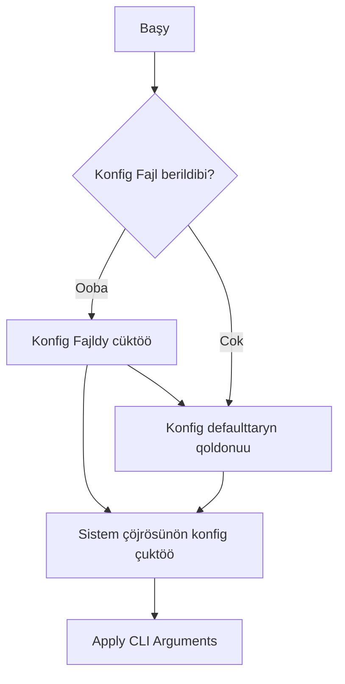
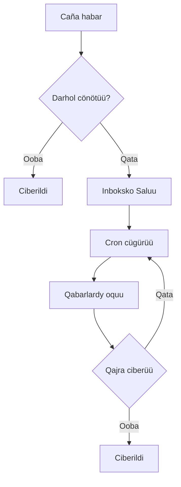

# Developerler üçün maalymat

Bul dokument KPow projektke qoşuluu üçün cardam beret.

-   **cmd/** – Cobra menen kurulgan CLI. `start` bujruğu uşul cerde.
-   **config/** – Konfiguraciya strukturalary, kömekçiler. `GetConfig` fajldardy, sistem çöjrödön, CLI flagtardan biriktiret.
-   **server/** – Negizgi qoşumça kody. HTTP serverdi, formany, şifrlöö, mailerler cana cron qyzmaty bar.
-   **styles/** – Tailwind CSS stilderi. `just styles` kompiliasijasyn atkarat.
-   **art/** – Dokumentasijada ce web interfejste pajdalanuuçu süröttör.

1. **Go'nu cüktöö** – Projekt Go modul sistemasyn pajdalanat. Go 1.21+ cüktöö kerek.
2. **Bun** – `just styles` üçün kerek.
3. **Serverdi candandyruu**

```sh
./kpow start --config=config.yml
```

CLI flagtary çöjrödön maanilerin cana konfiguraciya fajlyn bastary.

## Konfigurasija

Yrastoo parametrler TOML fajl menen, ortom özgörtüülör menen ce CLI flagtary menen berilet. `config/config.go` fajly bar parametrlerden habar beret. `config.toml` cana `example.env` dajarlap qoyulgän.

-   **Server** – Port, host, log cana requestterdi çektöö.
-   **Mailerler** – SMTP ce webhook arkyluu cönötüü. Ijgiliktüü cetkirilbese inbox folderine saktoo.
-   **Şifrlöö** – `age`, `pgp`, `rsa` açyk açkyç kol'donulat.
-   **Schedulér** – Cron job inboxdon cönötüügö araket qylat.

Konfigurasija fajlda açkyçty körsötüü misaly:

### Konfigurasija agymy



### Konfigurasijany tekşerüü

```sh
./kpow verify --config=config.toml
```

## Önök Tipter

-   **Şablondor** `server/templates/` da, forma cana qata better.
-   **Middleware** `server/server.go` – CSRF, rate limit, body çeklö.
-   **Cron jobtor** `server/cron/` içinde. Inbox-čisti ciberüü.
-   **Şifrlöö kyroyçtary** `server/enc/` içinde.

### Açkyç casoo

Age:

```sh
age-keygen -o age.key
grep "^# public key:" age.key | cut -d' ' -f3 > age.pub
```

PGP:

```sh
gpg --quick-generate-key "Sizdin Atynyz <siz@example.com>"
gpg --armor --export siz@example.com > pgp.pub
```

RSA:

```sh
openssl genpkey -algorithm RSA -out rsa_private.pem -pkeyopt rsa_keygen_bits:2048
openssl rsa -pubout -in rsa_private.pem -out rsa_public.pem
```

`rsa_public.pem` PKIX PEM formatynda boluşu kerek.

### Mailer qaytuu agymy



## Testterdi Jügürtüü

```sh
go test ./...
```

(Testter üçün internet kerek boluşu mümkün.)

## Salym Qoşuu

1. Repo-to fork casap, feature branch açynyz.
2. `gofmt` menen standart format saktañyz.
3. Caña funzionalnost üçün testter qosuu kerek.
4. PR cönötüü.

Formanyn, şifrlöö cana retry logikany toluk bilüü üçün `readme.md` cana `server` paketindegi komentarijlerdi qarañyz.

## Çygaruu

1. `just test` atqaryñyz.
2. `just build` ce GoReleaser qoldonulat.
3. Lisenzijalardy tekşerüü.
4. Syrduu maalymat bolso alardy kommitterden cokko çyğaryñyz.
5. Git tag çekiniz.

Projekt azyrynça Business Source License 1.1 astynda, README-da belgilengendey 2028-12-04 de Apache License 2.0gö daroo ötöt.
