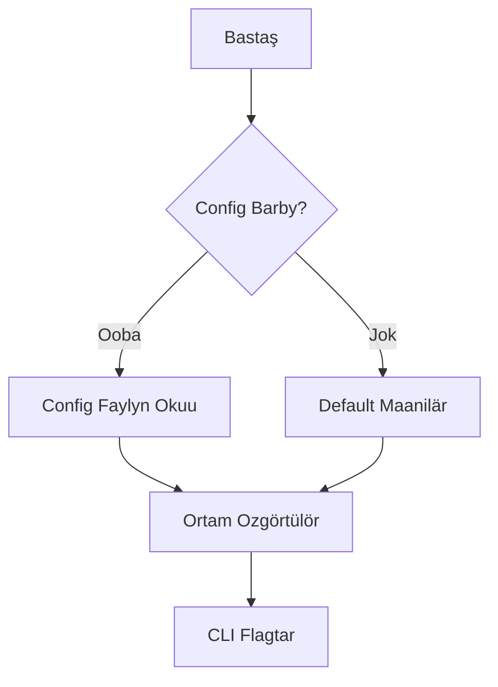

# Öndürüüçüler Geedigi

Bul dokument KPow proyektine qoşuluşu üçün nusravkamalar beret.

## Projekttin Quruluşu

- **cmd/** – Cobra menen kurulgen CLI. `start` buyruğu ushul yerde.
- **config/** – Konfiguraciya strukturalary, kömekçiler. `GetConfig` fajldardy, ortamdaykän değerlerden, CLI flagtardan biriktiret.
- **server/** – Negizgi qoşumça kody. HTTP serverdi, formany, şifrlöö, mailerler cana cron işteri bar.
- **styles/** – Tailwind CSS kaynaklary. `just styles` kompilyasiyasyn atkarat.
- **art/** – Dokumentaciyada ce web interfejste paydalanuulçu sürötter.

## Baştay Başdoo

1. **Go ornatuu** – Proyekt Go modulespaydalanat. Go 1.21+ ornatuu kerek.
2. **Bun (kaaloocu)** – `just styles` üçün kerek.
3. **Serverdi cügürgüzüü**
   ```sh
   go run main.go start
   ```
   CLI flagtary environment value cana konfiguraciya fajlyn bastary.

## Konfiguraciya

Jylamda parametirler TOML fajl menen, ortam özgörtüler menen ce CLI flagtary menen berilät. `config/config.go` fajly bar parametrlerden habar beret. `config.toml` cana `example.env` dajarlap qoyulgän.

Negizgi temalar:

- **Server** – Port, host, log cana suranyş çeklö.
- **Mailerler** – SMTP ce webhook menen cönötüü. Iyiğylbasa inbox folderge sakto.
- **Şifrlöö** – `age`, `pgp`, `rsa` publikalyk klyuhtar kol'donulur.
- **Schedulér** – Cron job inboxdan catty cönötüügö araket qylad.

Konfiguraciya fajlda açqyçty körsötüü misaly:

```toml
[key]
kind = "age"           # ce "pgp" ce "rsa"
path = "/etc/kpow/key.pub"
advertise = false
```

### Konfiguraciya agymy



### Konfiguraciyany tekşerüü

```sh
./kpow verify --config=config.toml
```

## Önök Tips

- **Şablondor** `server/templates/` da, forma cana qata better.
- **Middleware** `server/server.go` – CSRF, rate limit, body çeklö.
- **Cron jobtor** `server/cron/` içinde. Inbox-čisti ciberüü.
- **Şifrlöö kyroyçtary** `server/enc/` içinde.

### Klyuç casoo

Age:

```sh
age-keygen -o age.key
grep "^# public key:" age.key | cut -d' ' -f3 > age.pub
```

PGP:

```sh
gpg --quick-generate-key "Sizdin Atynyz <siz@example.com>"
gpg --armor --export siz@example.com > pgp.pub
```

RSA:

```sh
openssl genpkey -algorithm RSA -out rsa_private.pem -pkeyopt rsa_keygen_bits:2048
openssl rsa -pubout -in rsa_private.pem -out rsa_public.pem
```

`rsa_public.pem` PKIX PEM formatynda boluşu kerek.

### Mailer qaytuu agymy


## Testterdi Jügürtüü

```sh
go test ./...
```

(Testter qoldonmolordun cükteelüüsü üçün internet kerek bolup qaluşu mümkin.)

## Salym Qosuu

1. Repo-to fork casap, feature branch açynyz.
2. `gofmt` menen standart format saktañyz.
3. Caña funzionalnost üçün testter qosuu kerek.
4. PR cönötüü.

Formanyn, şifrlöö cana retry logikany tuluk bilüü üçün `readme.md` cana `server` paketindegi komentariyalarni qarañyz.

## Çygaruu

1. `just test` atqaryñyz.
2. `just build` ce GoReleaser menen binardyq faildar.
3. Litsenziyalar tekşerüü.
4. Siriätti tekşerip, syrly malymat joqtuğuna ynynuu.
5. Git tag qoşu.

Proyekt azyrça Business Source License 1.1 astynda, README-da belgilengendey 2028-12-04 de Apache License 2.0 go ote tygonot.
