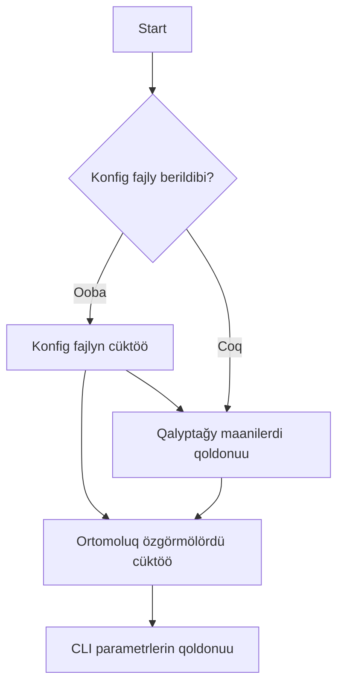
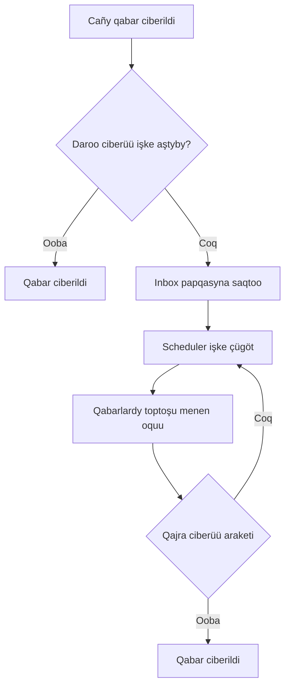

# Developerler üçün colbosçu

[English](../../developer-guide.md) | [Deutsch](../de/developer-guide.md) | [Türkçe](../tr/developer-guide.md) | [Qyrgyz](developer-guide.md) | [Français](../fr/developer-guide.md) | [Українська](../uk/developer-guide.md) | [Русский](../ru/developer-guide.md)

KPow projektine qoş keldiñiz! Bul dokument kodduq bazany çarlap, salym qoşuuğa cardam beret.

## Projekttun tüzümü

- **cmd/** – Cobra menen quralğan CLI. `start` buyruğu uşul cerde.
- **config/** – Konfiguratsija strukturalary cana kömökçülör. `GetConfig` konfig fajldardy, ortomoluq özgörmölördü cana CLI flagtardy biriktiret.
- **server/** – Negizgi qoşumça kody. HTTP serverdi, formany, şifrlöö, mailerler cana cron qyzmatyn qamtyjt.
- **styles/** – Tailwind CSS stilderi. `just styles` alardy `server/public/` astyndağy assetterge kompilijasijalajt.
- **art/** – Dokumentatsijada ce web interfejste pajdalanylğan süröttör.

## Baştalyşy

1. **Go'nu ornotuu** – Projekt Go modul sistemasyn pajdalanat. Go 1.21+ ornotulğan boluşu kerek.
2. **Bun ornotuu (mildetemes)** – `just styles` menen stilderdi qajra quruuğa kerek.
3. **Serverdi candandyruu**
    ```sh
    go run main.go start
    ```
    CLI flagtary ortomoluq özgörmölördü cana konfiguratsija fajldaryn basyjt (qarap `readme.md`).

## Konfiguratsija

Cajdoolor TOML fajl, ortomoluq özgörmölör ce CLI flagtary arqyluu berilet. Bar parametrlerdi `config/config.go` fajlynan qarap bilüügö bolot. `config.toml` cana `example.env` pajdaluu mysaldar beret.

Negizgi konfiguratsija temalary:

- **Server** – Port, host, logtoo cana suranuu çektöölörü.
- **Mailerler** – SMTP ce webhook arqyluu cönötüü. İjgiliktüü cetkirilbegen qabarlar inbox papqasyna saqtalat.
- **Şifrlöö** – `age`, `pgp` ce `rsa` açyq açqyçtaryn qoldonot. Açqyçtar baştalğanda cüktölöt cana forma qabarlaryn şifrlöögö pajdalanylat.
- **Scheduler** – Cron qyzmaty inbox papqasyndan ijgiliktüü cönötülbögön qabarlardy qajradan ciberüügö araket qylat.

Konfiguratsija fajlynda şifrlöö açqyçyn körsötüü üçün `[key]` bölümün qoşuñuz:

```toml
[key]
kind = "age"           # ce "pgp" ce "rsa"
path = "/etc/kpow/key.pub"
advertise = false
```

### Konfiguratsija ağymy


```mermaid
flowchart TD
    A[Start] --> B{Konfig fajly berildibi?}
    B -- Ooba --> C[Konfig fajlyn cüktöö]
    B -- Coq --> D[Qalyptağy maanilerdi qoldonuu]
    C --> E[Ortomoluq özgörmölördü cüktöö]
    C --> D
    D --> E
    E --> F[CLI parametrlerin qoldonuu]
```

### Konfiguratsijaŋyzdy tekşerüü

```sh
./kpow verify --config=config.toml
```

## Öndürüü keñeşteri

- **Şablondor** `server/templates/` da turup, HTML formany cana qata betterdi anıqtajt. UI'nu cajlaştyruu üçün alardy özgörtüñüz.
- **Middleware** `server/server.go` da cayğaştyryladı – CSRF qorğoo, rate limiting cana body çektöölörün uşul cerden tüzetüügö bolot.
- **Cron qyzmattary** `server/cron/` da cayğaşqan. Inbox tazalağyç maalimal arasy ijgiliktüü cönötülbögön qabarlardy qajra ciberüügö araket qylat.
- **Şifrlöö quraldarı** `server/enc/` da cayğaşqan. Maanilerdi şifrlöö bojunça testterdi cabıldardy qarañyz.

### Açqyçtardy casoo

Öndürüü üçün synaq açqyçtaryn casoo buyruqtary:

#### Age

```sh
age-keygen -o age.key
grep "^# public key:" age.key | cut -d' ' -f3 > age.pub
```

#### PGP

```sh
gpg --quick-generate-key "Your Name <you@example.com>"
gpg --armor --export you@example.com > pgp.pub
```

#### RSA

```sh
openssl genpkey -algorithm RSA -out rsa_private.pem -pkeyopt rsa_keygen_bits:2048
openssl rsa -pubout -in rsa_private.pem -out rsa_public.pem
```

`rsa_public.pem` fajly PKIX PEM formatynda boluşu kerek.

### Mailer qajra ciberüü ağymy


```mermaid
flowchart TD
    A[Cañy qabar ciberildi] --> B{Daroo ciberüü işke aştyby?}
    B -- Ooba --> C[Qabar ciberildi]
    B -- Coq --> D[Inbox papqasyna saqtoo]
    D --> E[Scheduler işke çügöt]
    E --> F[Qabarlardy toptoşu menen oquu]
    F --> G{Qajra ciberüü araketi}
    G -- Ooba --> H[Qabar ciberildi]
    G -- Coq --> E
```

## Testterdi cügürtüü

```sh
go test ./...
```

(Testter üçün internet bajlanyşy kerek boluşu mümkün.)

## Salym qoşuu

1. Repozitorijany fork casap, feature branch açyñyz.
2. Standart Go formatyn saqtañyz (`gofmt`).
3. Cañy funktsijonaldyk üçün testter qoşuñuz.
4. Cañy özgöçölük qoşqondo ce qata tüzötköndo testter mildetemes.
5. Özgörtüülörüñüzdü tasvirloo menen pull request cönötüñüz.

Formanyñ, şifrlöönün cana qajra ciberüü logikasynyñ işteşi tuuraluu tolyğuraaq `readme.md` cana `server` paketindegi komentarijlerdi qarañyz.

## Çyğaruu

Cañy relizge tag qojoodon murun, bul açyq bulaq tekşerme tizbemesin atqaryñyz:

1. `just test` arqyluu bardyq testterdin ötkönün tekşeriñiz.
2. `just build` ce GoReleaser menen binarnik quruñuz.
3. Bardyq köz karançılıqtardyn lisenzijasy qabyl alynarlıq ekenin tekşeriñiz.
4. Kommitterdi syr maaniler ce credential üçün tekşerip, sezdüü nerselerdi alalyñyz.
5. Reliz üçün cañy git tag casap, push qylyñyz.

Projekt azyrynça Business Source License 1.1 astynda cana README-da belgilengendej 2028-12-04 küni Apache License 2.0 gö ötöt.
