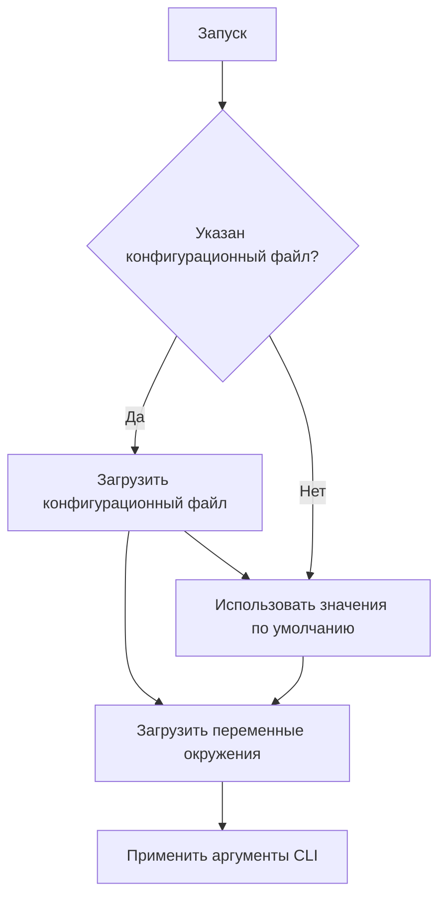
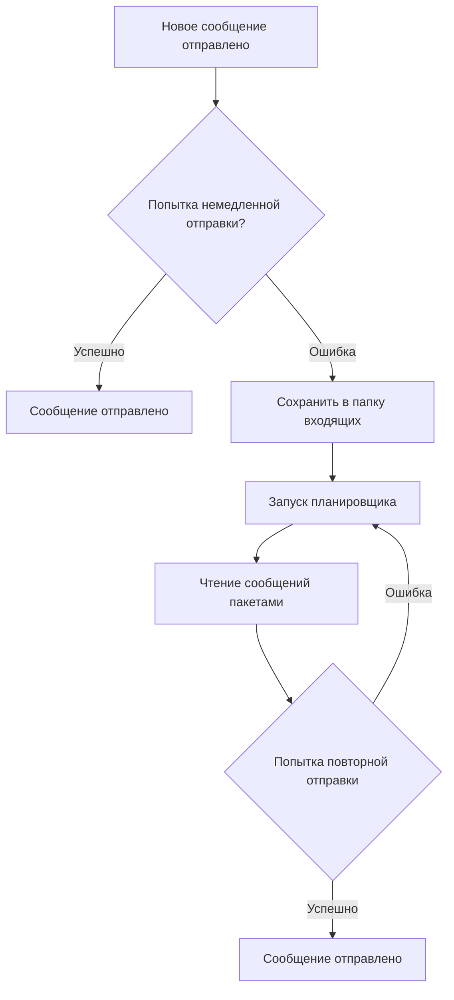

# Руководство разработчика

[English](../../developer-guide.md) | [Deutsch](../de/developer-guide.md) | [Türkçe](../tr/developer-guide.md) | [Qyrgyz](../qy/developer-guide.md) | [Français](../fr/developer-guide.md) | [Українська](../uk/developer-guide.md) | [Русский](developer-guide.md)

Добро пожаловать в проект KPow! Этот документ поможет вам ориентироваться в кодовой базе и вносить свой вклад в проект.

## Структура проекта

- **cmd/** – Интерфейс командной строки на основе Cobra. Здесь находится команда `start`.
- **config/** – Структуры конфигурации и вспомогательные функции. `GetConfig` объединяет конфигурационные файлы, переменные окружения и флаги CLI.
- **server/** – Основной код приложения. Содержит настройку HTTP-сервера, обработку форм, утилиты шифрования, почтовые модули и cron-задачи.
- **styles/** – Исходные файлы Tailwind CSS. `just styles` компилирует их в ресурсы в каталоге `server/public/`.
- **art/** – Изображения, используемые в документации или веб-интерфейсе.

## Начало работы

1. **Установите Go** – Проект использует Go-модули. Убедитесь, что установлен Go 1.21 или выше.
2. **Установите Bun (необязательно)** – Требуется для пересборки стилей с помощью `just styles`.
3. **Запустите сервер**
    ```sh
    go run main.go start
    ```
    Флаги CLI имеют приоритет над переменными окружения и конфигурационными файлами (см. `readme.md`).

## Конфигурация

Настройки можно задать через TOML-файл, переменные окружения или флаги CLI. Полный список доступных параметров см. в `config/config.go`. Примеры значений по умолчанию приведены в `config.toml` и `example.env`.

Основные разделы конфигурации:

- **Сервер** – Порт, хост, логирование и лимиты запросов.
- **Почтовые модули** – Отправка через SMTP или webhook. Недоставленные сообщения сохраняются в папке входящих.
- **Шифрование** – Поддерживаются открытые ключи `age`, `pgp` или `rsa`. Ключи загружаются при запуске и используются для шифрования отправленных форм.
- **Планировщик** – Cron-задача повторно пытается отправить недоставленные сообщения из папки входящих.

Чтобы указать ключ шифрования через конфигурационный файл, добавьте секцию `[key]`:

```toml
[key]
kind = "age"           # или "pgp" или "rsa"
path = "/etc/kpow/key.pub"
advertise = false
```

### Порядок загрузки конфигурации



### Проверка конфигурации

```sh
./kpow verify --config=config.toml
```

## Советы по разработке

- **Шаблоны** находятся в `server/templates/` и определяют HTML-форму и страницы ошибок. Измените их для настройки интерфейса.
- **Middleware** настраивается в `server/server.go` – здесь можно изменить защиту CSRF, ограничение частоты запросов и лимиты тела запроса.
- **Cron-задачи** расположены в `server/cron/`. Очистка папки входящих периодически пытается повторно отправить недоставленные сообщения.
- **Утилиты шифрования** находятся в `server/enc/`. Используйте тесты в этом каталоге как примеры шифрования данных.

### Генерация ключей

Используйте следующие команды для создания тестовых ключей при разработке:

#### Age

```sh
age-keygen -o age.key
grep "^# public key:" age.key | cut -d' ' -f3 > age.pub
```

#### PGP

```sh
gpg --quick-generate-key "Your Name <you@example.com>"
gpg --armor --export you@example.com > pgp.pub
```

#### RSA

```sh
openssl genpkey -algorithm RSA -out rsa_private.pem -pkeyopt rsa_keygen_bits:2048
openssl rsa -pubout -in rsa_private.pem -out rsa_public.pem
```

Файл `rsa_public.pem` должен содержать ключ в формате PKIX PEM.

### Порядок повторной отправки сообщений



## Запуск тестов

```sh
go test ./...
```

(Для запуска тестов может потребоваться доступ к сети для загрузки инструментов.)

## Участие в проекте

1. Сделайте форк репозитория и создайте ветку для новой функциональности.
2. Соблюдайте стандартное форматирование Go (`gofmt`).
3. По возможности добавляйте тесты для новой функциональности.
4. При добавлении новой функции или исправлении ошибки тесты обязательны.
5. Отправьте pull request с описанием ваших изменений.

Подробнее о работе формы, шифрования и логике повторных попыток см. `readme.md` и комментарии в исходном коде пакета `server`.

## Выпуск релизов

Перед созданием нового тега релиза выполните следующие шаги:

1. Запустите `just test`, чтобы убедиться, что все тесты проходят.
2. Соберите бинарные файлы с помощью `just build` или используйте GoReleaser для официальных релизов.
3. Убедитесь, что все зависимости используют допустимые лицензии.
4. Проверьте коммиты на наличие секретов или учётных данных и удалите всё конфиденциальное.
5. Создайте и отправьте новый git-тег для релиза.

Проект в настоящее время распространяется под лицензией Business Source License 1.1 и перейдёт на Apache License 2.0 04.12.2028, как указано в README.
