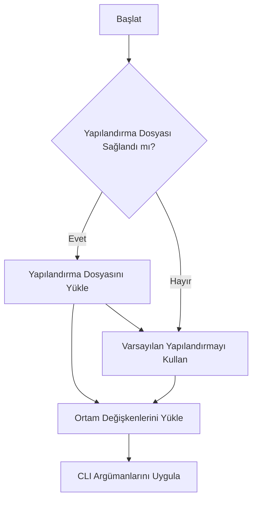
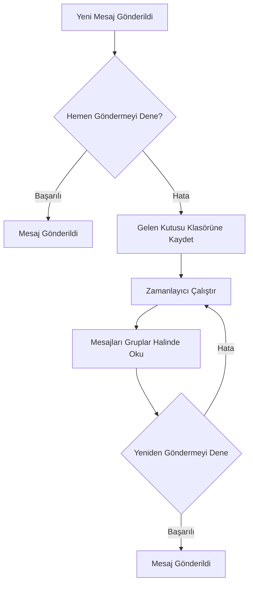

# Geliştirici Kılavuzu

[English](../../developer-guide.md) | [Deutsch](../de/developer-guide.md) | [Türkçe](developer-guide.md) | [Qyrgyz](../qy/developer-guide.md) | [Français](../fr/developer-guide.md) | [Українська](../uk/developer-guide.md) | [Русский](../ru/developer-guide.md)

KPow projesine hoş geldiniz! Bu belge, kod tabanında gezinmeniz ve katkıda bulunmanız için yol gösterici bilgiler sunar.

## Proje Yapısı

- **cmd/** – Cobra ile oluşturulmuş komut satırı arayüzü. `start` komutu burada yer alır.
- **config/** – Yapılandırma yapıları ve yardımcı fonksiyonlar. `GetConfig`, yapılandırma dosyalarını, ortam değişkenlerini ve CLI bayraklarını birleştirir.
- **server/** – Temel uygulama kodu. HTTP sunucu kurulumu, form işleme, şifreleme yardımcıları, posta göndericiler ve cron görevlerini içerir.
- **styles/** – Tailwind CSS kaynakları. `just styles` komutu bunları `server/public/` altındaki varlıklara derler.
- **art/** – Dokümantasyonda veya web arayüzünde kullanılan görseller.

## Başlarken

1. **Go Kurulumu** – Proje Go modüllerini kullanır. Go 1.21 veya üstünün kurulu olduğundan emin olun.
2. **Bun Kurulumu (isteğe bağlı)** – `just styles` ile stilleri yeniden derlemek için gereklidir.
3. **Sunucuyu çalıştırın**
    ```sh
    go run main.go start
    ```
    CLI bayrakları, ortam değişkenlerini ve yapılandırma dosyalarını geçersiz kılar (bkz. `readme.md`).

## Yapılandırma

Ayarlar TOML dosyası, ortam değişkenleri veya CLI bayrakları aracılığıyla sağlanabilir. Mevcut tüm seçenekler için `config/config.go` dosyasına bakın. `config.toml` ve `example.env` örnekleri faydalı varsayılan değerler sunar.

Temel yapılandırma konuları:

- **Sunucu** – Port, ana bilgisayar, günlükleme ve istek sınırları.
- **Posta göndericiler** – SMTP veya webhook hedefleri. Başarısız mesajlar bir gelen kutusu klasöründe saklanır.
- **Şifreleme** – `age`, `pgp` veya `rsa` açık anahtarlarını destekler. Anahtarlar başlangıçta yüklenir ve form gönderimlerini şifrelemek için kullanılır.
- **Zamanlayıcı** – Bir cron görevi, gelen kutusundaki başarısız mesajları yeniden göndermeyi dener.

Şifreleme anahtarını yapılandırma dosyasıyla belirtmek için bir `[key]` bölümü ekleyin:

```toml
[key]
kind = "age"           # veya "pgp" ya da "rsa"
path = "/etc/kpow/key.pub"
advertise = false
```

### Yapılandırma akışı



### Yapılandırmanızı doğrulayın

```sh
./kpow verify --config=config.toml
```

## Geliştirme İpuçları

- **Şablonlar** `server/templates/` altında yer alır ve HTML formunu ile hata sayfalarını tanımlar. Arayüzü özelleştirmek için bunları güncelleyin.
- **Ara katman yazılımı** `server/server.go` içinde yapılandırılır – CSRF koruması, hız sınırlama ve gövde sınırları burada ayarlanabilir.
- **Cron görevleri** `server/cron/` altında bulunur. Gelen kutusu temizleyici, başarısız mesajları düzenli olarak yeniden göndermeye çalışır.
- **Şifreleme araçları** `server/enc/` içinde yer alır. Veri şifreleme örnekleri için buradaki testleri referans olarak kullanın.

### Anahtar Oluşturma

Geliştirme için test anahtarları oluşturmak üzere aşağıdaki komutları kullanın:

#### Age

```sh
age-keygen -o age.key
grep "^# public key:" age.key | cut -d' ' -f3 > age.pub
```

#### PGP

```sh
gpg --quick-generate-key "Your Name <you@example.com>"
gpg --armor --export you@example.com > pgp.pub
```

#### RSA

```sh
openssl genpkey -algorithm RSA -out rsa_private.pem -pkeyopt rsa_keygen_bits:2048
openssl rsa -pubout -in rsa_private.pem -out rsa_public.pem
```

`rsa_public.pem` dosyası PKIX PEM kodlamalı bir anahtar içermelidir.

### Posta gönderici yeniden deneme akışı



## Testleri Çalıştırma

```sh
go test ./...
```

(Testler, araç zincirlerini indirmek için ağ erişimi gerektirebilir.)

## Katkıda Bulunma

1. Depoyu çatallayın ve bir özellik dalı oluşturun.
2. Standart Go biçimlendirmesini (`gofmt`) takip edin.
3. Mümkün olduğunda yeni işlevsellik için testler ekleyin.
4. Yeni bir özellik eklerken veya bir hata düzeltirken testler gereklidir.
5. Değişikliklerinizi açıklayan bir pull request gönderin.

Formun, şifrelemenin ve yeniden deneme mantığının nasıl çalıştığına dair daha ayrıntılı bilgi için `readme.md` dosyasına ve `server` paketi genelindeki kaynak kod yorumlarına bakın.

## Yayınlama

Yeni bir sürüm etiketlemeden önce bu açık kaynak kontrol listesini tamamlayın:

1. Tüm testlerin geçtiğini doğrulamak için `just test` komutunu çalıştırın.
2. `just build` ile ikili dosyaları derleyin veya resmi sürümler için GoReleaser kullanın.
3. Tüm bağımlılıkların kabul edilebilir lisanslara sahip olduğunu doğrulayın.
4. Commit geçmişini gizli bilgiler veya kimlik bilgileri açısından gözden geçirin ve hassas her şeyi kaldırın.
5. Sürüm için yeni bir git etiketi oluşturun ve gönderin.

Proje şu anda Business Source License 1.1 altındadır ve README'de belirtildiği üzere 04.12.2028 tarihinde Apache License 2.0'a geçecektir.
