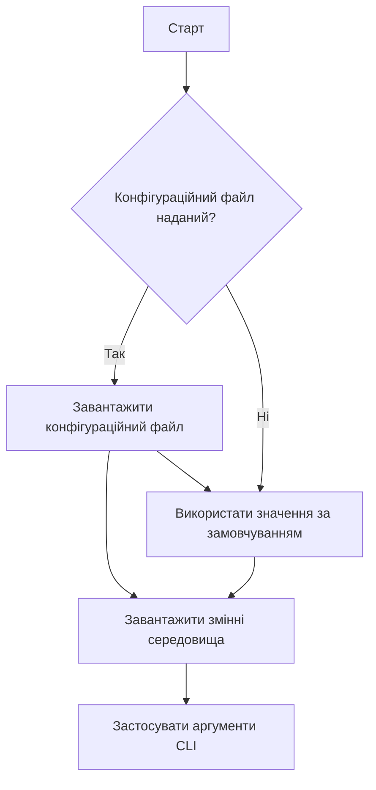
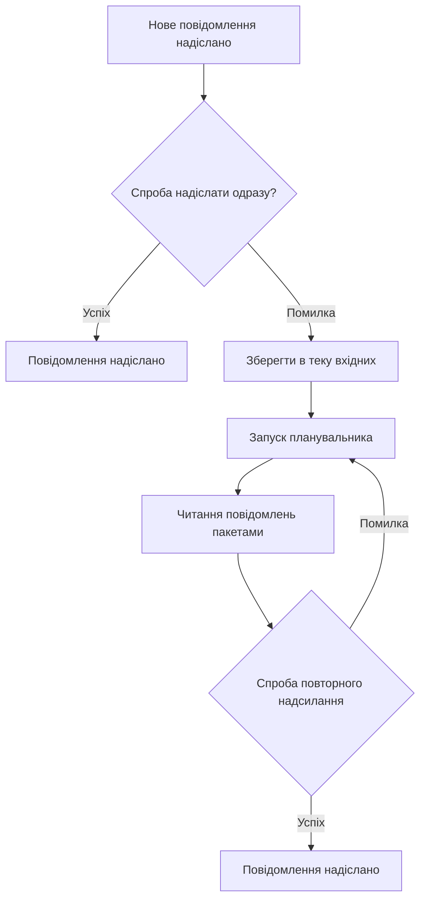

# Посібник розробника

[English](../../developer-guide.md) | [Deutsch](../de/developer-guide.md) | [Türkçe](../tr/developer-guide.md) | [Qyrgyz](../qy/developer-guide.md) | [Français](../fr/developer-guide.md) | [Українська](developer-guide.md) | [Русский](../ru/developer-guide.md)

Ласкаво просимо до проєкту KPow! Цей документ допоможе вам орієнтуватися в кодовій базі та робити внески.

## Структура проєкту

- **cmd/** – Інтерфейс командного рядка на основі Cobra. Тут знаходиться команда `start`.
- **config/** – Структури конфігурації та допоміжні функції. `GetConfig` об'єднує конфігураційні файли, змінні середовища та прапорці CLI.
- **server/** – Основний код застосунку. Містить налаштування HTTP-сервера, обробку форм, шифрування, поштові служби та cron-завдання.
- **styles/** – Джерельні файли Tailwind CSS. `just styles` компілює їх у ресурси в `server/public/`.
- **art/** – Зображення, що використовуються в документації або веб-інтерфейсі.

## Початок роботи

1. **Встановіть Go** – Проєкт використовує Go-модулі. Переконайтеся, що у вас встановлено Go 1.21+.
2. **Встановіть Bun (необов'язково)** – Потрібен для перебудови стилів за допомогою `just styles`.
3. **Запустіть сервер**
    ```sh
    go run main.go start
    ```
    Прапорці CLI мають пріоритет над змінними середовища та конфігураційними файлами (див. `readme.md`).

## Конфігурація

Налаштування можна задати через TOML-файл, змінні середовища або прапорці CLI. Перелік усіх доступних параметрів див. у `config/config.go`. Приклади наведено у `config.toml` та `example.env`.

Основні розділи конфігурації:

- **Сервер** – Порт, хост, логування та обмеження запитів.
- **Поштові служби** – Надсилання через SMTP або webhook. Невдалі повідомлення зберігаються в теці вхідних.
- **Шифрування** – Підтримка публічних ключів `age`, `pgp` або `rsa`. Ключі завантажуються при старті та використовуються для шифрування відправлених форм.
- **Планувальник** – Cron-завдання повторює спроби надсилання невдалих повідомлень із теки вхідних.

Щоб вказати ключ шифрування через конфігураційний файл, додайте секцію `[key]`:

```toml
[key]
kind = "age"           # або "pgp" чи "rsa"
path = "/etc/kpow/key.pub"
advertise = false
```

### Послідовність завантаження конфігурації



### Перевірка конфігурації

```sh
./kpow verify --config=config.toml
```

## Поради для розробки

- **Шаблони** знаходяться в `server/templates/` і визначають HTML-форму та сторінки помилок. Змінюйте їх для налаштування інтерфейсу.
- **Middleware** налаштовується в `server/server.go` – захист CSRF, обмеження частоти запитів та розміру тіла запиту.
- **Cron-завдання** знаходяться в `server/cron/`. Очищувач теки вхідних періодично намагається повторно надіслати невдалі повідомлення.
- **Утиліти шифрування** розташовані в `server/enc/`. Використовуйте тести як приклади для шифрування даних.

### Генерація ключів

Використовуйте наступні команди для створення тестових ключів для розробки:

#### Age

```sh
age-keygen -o age.key
grep "^# public key:" age.key | cut -d' ' -f3 > age.pub
```

#### PGP

```sh
gpg --quick-generate-key "Your Name <you@example.com>"
gpg --armor --export you@example.com > pgp.pub
```

#### RSA

```sh
openssl genpkey -algorithm RSA -out rsa_private.pem -pkeyopt rsa_keygen_bits:2048
openssl rsa -pubout -in rsa_private.pem -out rsa_public.pem
```

Файл `rsa_public.pem` має містити ключ у форматі PKIX PEM.

### Послідовність повторного надсилання



## Запуск тестів

```sh
go test ./...
```

(Для тестів може знадобитися доступ до мережі для завантаження інструментів.)

## Внески

1. Зробіть форк репозиторію та створіть гілку для нової функціональності.
2. Дотримуйтесь стандартного форматування Go (`gofmt`).
3. За можливості додавайте тести для нової функціональності.
4. При додаванні нової функції або виправленні помилки тести є обов'язковими.
5. Надішліть pull request з описом ваших змін.

Детальніше про роботу форми, шифрування та логіку повторних спроб див. у `readme.md` та коментарях у пакеті `server`.

## Релізи

Перед тим як створити новий реліз, пройдіть цей контрольний список:

1. Запустіть `just test`, щоб переконатися, що всі тести проходять.
2. Зберіть бінарні файли за допомогою `just build` або GoReleaser для офіційних релізів.
3. Перевірте, що всі залежності мають прийнятні ліцензії.
4. Перегляньте коміти на наявність секретів або облікових даних і видаліть усе конфіденційне.
5. Створіть і відправте новий git-тег для релізу.

Проєкт наразі ліцензовано під Business Source License 1.1 і, як зазначено в README, він перейде на Apache License 2.0 04.12.2028.
